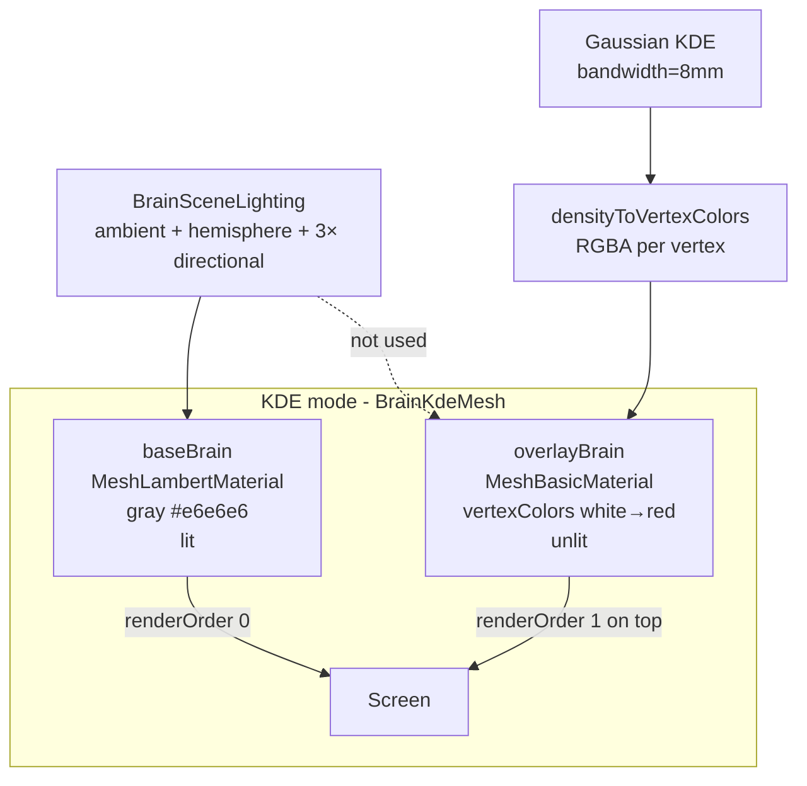

# KDE 投影失去沟回立体感 — 原因分析

Last updated: 2026-05-26

This document explains why the **KDE projection** mode in the HGA Phase Overlap Viewer looks flat and loses visible sulci/gyri structure when the white-to-red colormap is applied. **Analysis only — no rendering changes in this document.**

---

## Symptom

In **KDE projection** mode, the cortical surface covered by the white→red gradient loses clear sulcal/gyral boundaries. The brain reads as a flat color patch on a sphere rather than a folded 3D cortex. Temporal and other high-curvature regions are especially affected: color transitions are soft and anatomical relief disappears.

The geometry is not missing — `cvs_avg35_pial.glb` is a pial surface with real folds. The problem is **how the color layer is rendered** and whether **lighting information is preserved**.

---

## Current rendering architecture

KDE mode uses **two overlapping brain meshes**, not a single mesh with simultaneous scalar coloring and lighting:



### Key code paths

| Component | File | Role |
|-----------|------|------|
| Dual mesh render | `src/components/brain/BrainKdeMesh.jsx` | Renders `baseBrain` + `overlayBrain` |
| Base material (lit) | `src/lib/brainMesh.js` | `MeshLambertMaterial`, gray cortex |
| Overlay material (unlit) | `src/lib/brainMesh.js` | `MeshBasicMaterial` + `vertexColors: true` |
| Color mapping | `src/brainKde.js` | KDE → per-vertex RGBA |
| Lighting | `src/components/brain/BrainSceneLighting.jsx` | MNE-style multi-light setup |

**Takeaway:** Sulcal/gyral depth cues come from Lambert shading on the base mesh (normal × light). The overlay is drawn on top and, wherever data exists, replaces that shading with flat interpolated color.

---

## Root causes (ranked by impact)

### 1. Primary — Overlay uses `MeshBasicMaterial` (no lighting)

`MeshBasicMaterial` outputs vertex/fragment color directly and **ignores all lights**.

- **Base mesh:** Gyral crowns facing the light are bright; sulcal walls facing away are dark → readable folds.
- **Overlay:** Any vertex with KDE density > 0 gets a fixed RGB (white or red) with **the same brightness regardless of surface normal**.

In regions with HGA projection, you see a flat color shell, not a lit cortical surface. This is an **architectural** issue, not something opacity alone can fix.

```50:66:viewer/phase_overlap/src/lib/brainMesh.js
export function applyKdeOverlayMaterial(root, hemisphereView) {
  // ...
    child.material = new THREE.MeshBasicMaterial({
      vertexColors: true,
      transparent: true,
      opacity: 1,
      alphaTest: 0.01,
      // ...
    });
    child.renderOrder = 1;
```

### 2. Primary — Overlay alpha is binary (0 or 1)

In `densityToVertexColors`:

- `density <= 0` → alpha = 0 (transparent; base gray brain visible)
- `density > 0` → alpha = 1 (fully opaque)

Any non-zero HGA signal **completely hides** the lit base cortex underneath. Users see either pure overlay color or gray brain — not a meaningful blend of color + structure.

```448:468:viewer/phase_overlap/src/brainKde.js
  for (let i = 0; i < vertexCount; i += 1) {
    const value = density[i];
    if (value <= 0) {
      colors[i * 4 + 3] = 0;
      continue;
    }
    // ...
    colors[i * 4 + 3] = 1;
  }
```

Default brain opacity is 0.9 (`DEFAULT_KDE_BRAIN_OPACITY`), but that only affects the base mesh; under opaque overlay pixels the base is invisible anyway.

### 3. Secondary — Gaussian KDE spatial smoothing (8 mm bandwidth)

KDE parameters in `brainKde.js`:

- `KDE_BANDWIDTH = 8.0` mm
- `KDE_MAX_DISTANCE = 15.0` mm

Each vertex color is a weighted average of nearby electrode HGA over ~8–15 mm. Effects:

- Sulcal banks, sulcal fundus, and adjacent gyral crowns get **similar density values**
- Color is **smoothed across folds**, reducing high-frequency anatomical contrast even if lighting were restored

This explains blurred boundaries, not just missing shadows.

### 4. Secondary — Colormap low end ≈ white + white background

Colormap: seaborn `vlag` positive half (`VLAG_POSITIVE_LUT`). Low density ≈ `[0.98, 0.96, 0.96]`.

Scene background is also `#ffffff` (`BrainSceneLighting.jsx`).

Low-density regions have **very low luminance contrast** against the background, reinforcing a flat appearance.

### 5. Contributing — No other depth cues

Not implemented:

- Ambient occlusion (SSAO or baked AO)
- Normal maps
- Specular / roughness (brain uses Lambert only)
- Post-processing

In **Electrodes** mode, a single lit mesh still provides normal-based shading. In KDE mode, overlay regions lose all of these cues. Electrodes use `MeshStandardMaterial` and can look more “3D” than the brain surface.

### 6. Not primary — Mesh resolution / flat shading

After hemisphere split, `computeVertexNormals()` enables **smooth shading** (default). Visible faceting in screenshots is more likely an **unlit + bright flat color** artifact than insufficient geometry.

**Geometry is likely adequate; the rendering pipeline makes fine structure unreadable.**

---

## Why this is hard to fix

| Challenge | Explanation |
|-----------|-------------|
| **Data vs structure goals** | KDE encodes “where HGA is high”; folds encode “surface orientation.” Unlit overlay prioritizes the former. |
| **Lit + vertexColors** | `MeshLambertMaterial({ vertexColors: true })` multiplies color × lighting — correct direction but colors darken/shift; colormap or shader tuning needed. |
| **Custom shader cost** | Ideal: `finalColor = colormap(density) * lambert(normal)` via `onBeforeCompile` or custom GLSL; must handle transparency, clipping, animation frame cache. |
| **KDE smoothness vs anatomy** | Smaller bandwidth restores boundaries but increases speckle; may conflict with smooth whole-brain map aesthetics (MNE/Freesurfer style). |
| **Performance** | Vertex colors precomputed in a worker; per-pixel lighting or SSAO adds GPU/CPU cost. |
| **Alpha tradeoff** | Semi-transparent overlay reveals base shading but weakens color semantics and can look muddy when blended. |

---

## Comparison with notebook / MNE-style static maps

In `univarite.ipynb`, brain maps are typically drawn on the surface **with shading preserved** (matplotlib / Mayavi / PyVista-style scalar fields on lit surfaces).

The current web viewer is closer to:

> Draw a shaded gray brain, then paste an **unlit, often opaque sticker** on top.

Once the sticker is opaque, surface shading disappears. That gap explains much of the visual difference from static notebook figures.

---

## Future fix directions (not implemented)

Ordered by likely effort vs impact:

1. **Lit overlay** — `MeshLambertMaterial` / `MeshStandardMaterial` + `vertexColors` so colormap multiplies with normal shading (smallest architectural change).
2. **Continuous alpha** — Map density to alpha instead of 0/1 so low-density areas show underlying structure.
3. **Colormap / background** — Avoid near-white at low density; use light gray background for contrast.
4. **Reduce or adapt KDE bandwidth** — Preserve more sulcal-scale spatial detail (with speckle tradeoff).
5. **SSAO / normal-based shading** — Extra depth cues (highest implementation and performance cost).

---

## One-sentence summary

**Sulci and gyri are still in the mesh; they are hidden by an unlit, fully opaque (where data exists), 8 mm–smoothed color shell that covers the only source of 3D relief — Lambert shading on the base cortex.**

Restoring both **HGA semantics** and **anatomical depth** requires recombining color and lighting (lit overlay, shader, or alpha blending) and balancing KDE smoothness against fold-scale detail.
